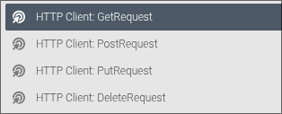
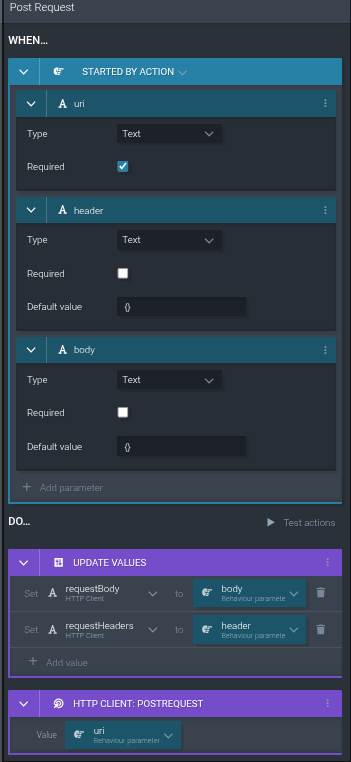
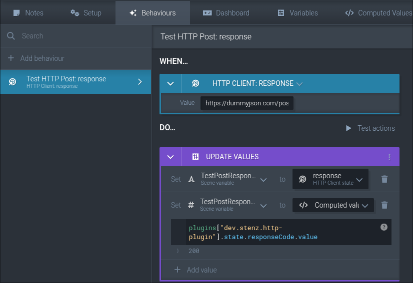

# Cogs HTTP Client with return values

This is an HTTP Client plugin for [COGS](https://cogs.show/) with configurable request Body, Request headers and Responses.

A Demonstration of how the plugin can be implemented in COGS is also in the `cogs-test` directory.

## How to Use
1. Download the latest release
2. [Add the plugin](https://docs.cogs.show/plugins/how-to-install/) to your project
3. To make a request choose the HTTP Action: GetRequest, Post, Put or Delete.

4. Set Header and Body if required, then make the request to the uri.

5. To listen to the response event, add a `HTTP Client: response` behavior and put the request uri as the value to listen to a specific request.

## Events and States

### Response Events
The response event will trigger after a GET, POST, PUT or DELETE request has been finished. You can catch the response in COGS with the uri that was passed to the request.

### States
#### `response` and `responseCode`
The `response` state is a String and contains the response from the request. This state will change with each request. It is recommended to save the response to a local variable in COGS upon the response behavior trigger.

The `responseCode` is similar to the `response`, but it contains the status code of the request (e.g. 200, 500...). It will default to 500 if an error is thrown.

#### `requestHeaders` and `requestBody`
The `requestHeaders` and `requestBody` can be written from cogs and should contain a JSON String with the desired Headers and Body. `requestBody` will be ignored on GET requests. Don't use single quotes in the JSON String, this will lead to parsing errors.

## Building
To build the project run `yarn install` and `yarn build`

## Author
If you have any questions, need support or ideas to improve this plugin, reach out to me on the COGS Discord :)
